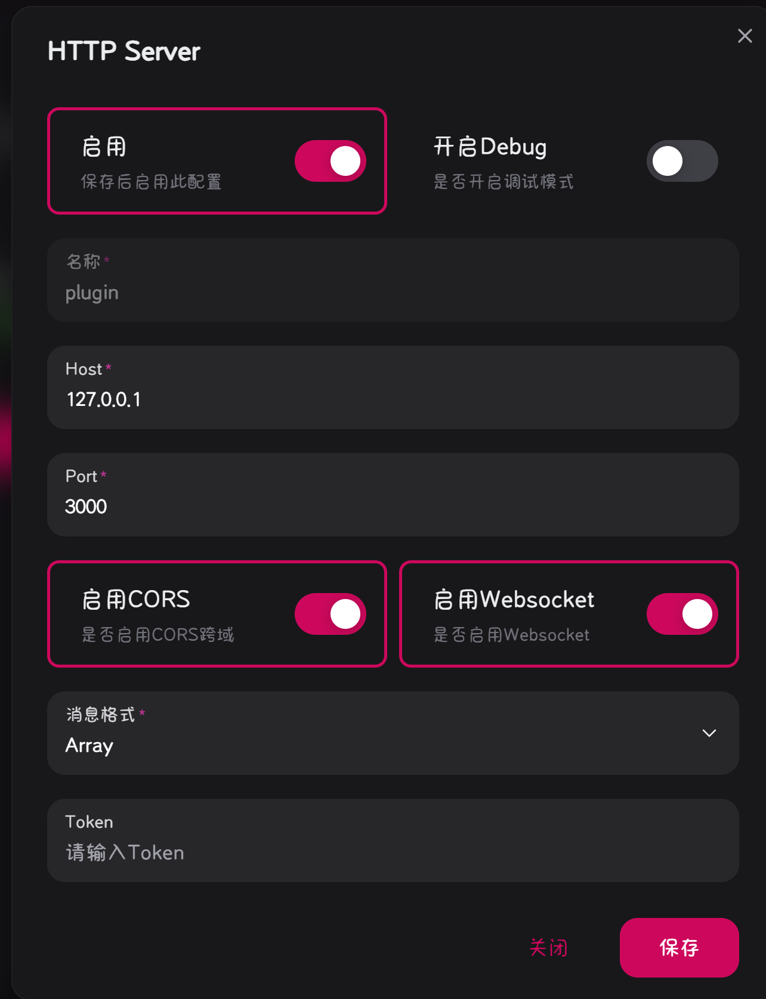

<h1 align="center">ChunithmUtil</h1>

<h4 align="center">集成了多项Chunithm实用功能的LangBot插件🧩</h4>

<div align="center">


</div>

## 介绍🤔

《CHUNITHM》是一款由SEGA开发的街机音乐游戏。其主要玩法为配合音乐节奏，通过触碰键盘或抬手以进行相应操作。CHUNITHM于2015年7月16日在日本开始运营。游戏内置多首乐曲并配有不同难度的谱面供玩家游玩。

> 引自萌娘百科，阅读更多：[https://zh.moegirl.org.cn/CHUNITHM](https://zh.moegirl.org.cn/CHUNITHM)

本插件旨在降低游玩Chunithm的门槛，为玩家提供多项Chunithm相关的实用功能，以更好地提升自身游玩技术。

## 特性✨

- ✅：已实现
- 🚧：开发中
- ❌：未实现

|功能|描述|实现|
|---|---|---|
|模糊搜索|根据别名匹配曲目|✅|
|精准搜索|根据cid匹配曲目|✅|
|添加别名|为曲目添加别名|✅|
|容错计算|计算曲目达成鸟/鸟加的容错|✅|
|谱面查询|获取曲目预览谱面|✅|
|随机歌曲|随机获取一首曲目|✅|
|定数列表|获取指定定数的所有曲目|✅|
|曲师查询|获取指定曲师的所有曲目|✅|
|谱师查询|获取指定谱师的所有曲目|✅|
|自动更新|自动获取新版本曲目信息|✅|
|段位曲目|获取指定段位的曲目列表|🚧|
|谱面预览|获取曲目谱面预览视频链接|🚧|

## 插件安装🛠️

配置完成 [LangBot](https://github.com/RockChinQ/QChatGPT) 主程序后使用管理员账号向机器人发送命令即可安装：

```
!plugin get https://github.com/AmethystTim/ChunithmUtil.git
```
或查看详细的[插件安装说明](https://github.com/RockChinQ/QChatGPT/wiki/5-%E6%8F%92%E4%BB%B6%E4%BD%BF%E7%94%A8)

## 使用说明📖

### 网络配置

访问**消息平台**配置`HTTP`服务器

以`NapCat`为例，访问`127.0.0.1:6099`，配置信息如下：

<div align="center">



</div>

### 获取数据

插件安装完成后，需要获取歌曲**元数据**和谱面ID-歌曲的**映射表**，登录`LangBot webui`进行**重载插件**即可自动获取更新数据

```python
utils/songmeta.py    # 获取歌曲元数据
utils/mapping.py     # 获取谱面ID-歌曲的映射表
```

> `Chunithm`版本更新后，需重载插件以获取新曲数据

## 指令🤖

|指令|描述|参数|示例|
|---|---|---|---|
|[别名]是什么歌|模糊搜索歌曲|别名|特大是什么歌|
|chu查歌[歌曲全名/cid]|精准搜索cid对应歌曲|歌曲全名/cid|chu查歌c114|
|chu随机一曲|随机获取一首曲目|-|-|
|alias [cid] [别名1,别名2,…]|为曲目添加别名|cid, 别名1, 别名2, …|alias c114 特16bit,16比特战争|
|别名[cid]|查询歌曲别名|cid|别名c114|
|chuchart [cid/别名] (难度: mas)|获取指定曲目谱面预览|cid/别名, 难度(exp/mas/ult)|chuchart aleph-0 ult|
|chu lv [定数]|获取指定定数的所有曲目|难度定数|chu lv 14.5|
|chu容错 [cid/别名] (难度: mas)|计算指定曲目达成鸟/鸟加的容错|cid/别名, 难度(exp/mas/ult)|chu容错 yurushite|
|chu曲师 [曲师名]|获取指定曲师的所有曲目|曲师名|chu曲师 void|
|chu谱师 [谱师名]|获取指定谱师的所有曲目|谱师名|chu谱师 techno kitchen|


## 数据源

- 歌曲元数据：[data.json](https://dp4p6x0xfi5o9.cloudfront.net/chunithm/data.json)
- Chunithm谱面保管室：[https://sdvx.in/chunithm.html](https://sdvx.in/chunithm.html)

## 鸣谢

- 感谢[@Hitagisugoi](https://github.com/Hitagisugoi)提出的的谱师/曲师查询功能建议